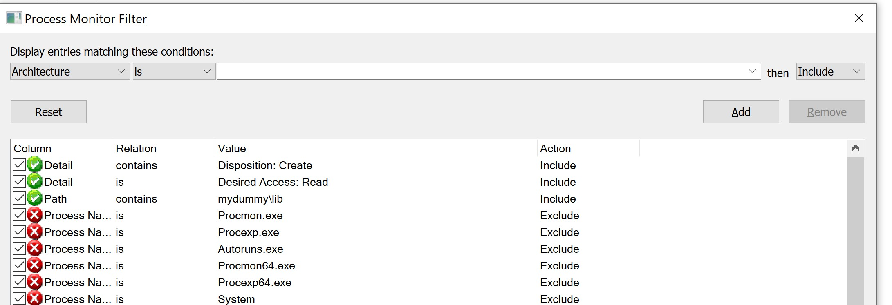
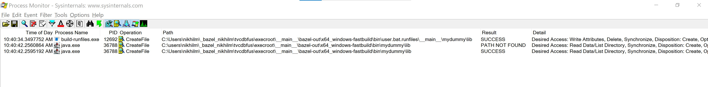
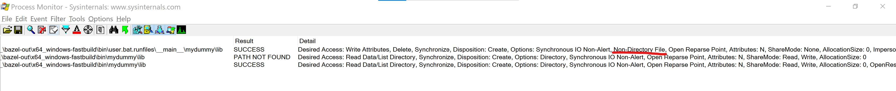
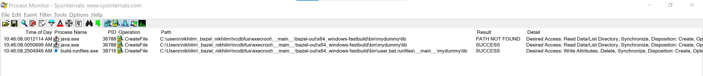
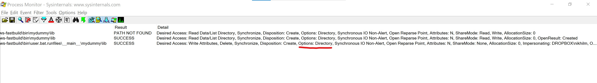

# Demonstration of Bazel runfiles bug

This repository demonstrates a potential bug.
The bug is a race condition in runfiles tree creation, possibly Windows ONLY.

Tested on:
- Windows 10
- Long paths and symlinks enabled for the user running this.
- Bazel 3.4.1
- See .bazelrc for option that forces Bazel to create runfiles tree on Windows.

## Details of the bug

If:
1. a rule depends on other rules to create its runfiles,
2. The dependency creates _a directory_, and
3. Due to dependencies of the dependencies taking time to build, the _directory that should end up in runfiles_ takes a while to build.

Then: It is possible for the runfiles tree to have a _file symlink_ instead of a _directory symlink_.

Expected behavior: The runfiles tree should always be created after all runfiles dependencies are ready, and directories should be represented by _directory symlinks_ in the runfiles tree.

Actual behavior: The runfiles tree is created before runfiles dependencies are ready, leading to an incorrect _file symlink_ to a directory.

This happens because Bazel seems to create the runfiles tree before the directory creating action is run.
When Bazel does this, it uses `build-runfiles.exe` on Windows. This parses the runfiles manifest and creates symlinks. Symlinks are created [here](https://github.com/bazelbuild/bazel/blob/a6fccbb5f28972475f57821ac67db7dd993b2174/src/main/tools/build-runfiles-windows.cc#L383).
Since this executable is invoked _too early_, the `blaze_util::IsDirectoryW` check returns false, so a _file symlink_ is created. This is _allowed_ by Windows as symlinks may point to non-existent files. This is probably why the bug was not caught earlier.

## How to use this repository to see the bug.

1. Clone the repo
2. Read through the `BUILD` file and `dummy.bzl` to understand what is going on. Basically, `user` is just a simple batch script target that prints out the runfiles tree. It depends on `mydummy` which produces a _directory_ (`mydummy\lib`) that is part of `user`'s runfiles. This directory itself depends on `i_sleep`, which just sleeps to make the race condition obvious.
3. It can be useful to use the Process Monitor tools from sys-internals, with the following filters to see the commands executed. The green filters are what I've added and the red ones are defaults.



**It is _very important_ to `bazel clean` between runs, otherwise the directory will already exist, the race will not manifest, and everything will work correctly.**

### Bug happens

```
bazel clean
bazel run :user
```

Output

```
INFO: Analyzed target //:user (4 packages loaded, 8 targets configured).
INFO: Found 1 target...
Target //:user up-to-date:
  bazel-bin/user.bat
INFO: Elapsed time: 12.811s, Critical Path: 9.72s
INFO: 2 processes: 2 local.
INFO: Build completed successfully, 6 total actions
INFO: Build completed successfully, 6 total actions
------------CURRENT DIR--------------
 Volume in drive C is system
 Volume Serial Number is AA07-0727

 Directory of c:\users\nikhilm\_bazel~1\tvcdbfus\execroot\__main__\bazel-~1\x64_wi~1\bin\userba~2.run\__main__

09/01/2020  10:40 AM    <DIR>          .
09/01/2020  10:40 AM    <DIR>          ..
09/01/2020  10:40 AM    <DIR>          mydummy
09/01/2020  10:40 AM    <SYMLINK>      user.bat [\\?\C:\users\nikhilm\_bazel_nikhilm\tvcdbfus\execroot\__main__\bazel-out\x64_windows-fastbuild\bin\user.bat]
               1 File(s)              0 bytes
               3 Dir(s)  842,240,598,016 bytes free
------------mydummy DIR--------------
 Volume in drive C is system
 Volume Serial Number is AA07-0727

 Directory of c:\users\nikhilm\_bazel~1\tvcdbfus\execroot\__main__\bazel-~1\x64_wi~1\bin\userba~2.run\__main__\mydummy

09/01/2020  10:40 AM    <DIR>          .
09/01/2020  10:40 AM    <DIR>          ..
09/01/2020  10:40 AM    <SYMLINK>      lib [\\?\C:\users\nikhilm\_bazel_nikhilm\tvcdbfus\execroot\__main__\bazel-out\x64_windows-fastbuild\bin\mydummy\lib]
               1 File(s)              0 bytes
               2 Dir(s)  842,240,598,016 bytes free
```

Observe how it says `SYMLINK`.

Also notice how build-runfiles.exe ran before java.exe.




### Bug doesn't happen

If we remove the delay, the directory creation action can sneak in before runfiles are created and things work.
To do this, comment out the `i_sleep` dependency in `dummy` in the `BUILD` file.

```
dummy_dir(
    name = "mydummy",
    # sleep_on = ":i_sleep",
)
```

```
bazel clean
bazel run :user
```

Output:

```
INFO: Analyzed target //:user (4 packages loaded, 7 targets configured).
INFO: Found 1 target...
Target //:user up-to-date:
  bazel-bin/user.bat
INFO: Elapsed time: 3.092s, Critical Path: 2.16s
INFO: 1 process: 1 local.
INFO: Build completed successfully, 5 total actions
INFO: Build completed successfully, 5 total actions
------------CURRENT DIR--------------
 Volume in drive C is system
 Volume Serial Number is AA07-0727

 Directory of c:\users\nikhilm\_bazel~1\tvcdbfus\execroot\__main__\bazel-~1\x64_wi~1\bin\userba~2.run\__main__

09/01/2020  10:46 AM    <DIR>          .
09/01/2020  10:46 AM    <DIR>          ..
09/01/2020  10:46 AM    <DIR>          mydummy
09/01/2020  10:46 AM    <SYMLINK>      user.bat [\\?\C:\users\nikhilm\_bazel_nikhilm\tvcdbfus\execroot\__main__\bazel-out\x64_windows-fastbuild\bin\user.bat]
               1 File(s)              0 bytes
               3 Dir(s)  842,238,795,776 bytes free
------------mydummy DIR--------------
 Volume in drive C is system
 Volume Serial Number is AA07-0727

 Directory of c:\users\nikhilm\_bazel~1\tvcdbfus\execroot\__main__\bazel-~1\x64_wi~1\bin\userba~2.run\__main__\mydummy

09/01/2020  10:46 AM    <DIR>          .
09/01/2020  10:46 AM    <DIR>          ..
09/01/2020  10:46 AM    <SYMLINKD>     lib [\\?\C:\users\nikhilm\_bazel_nikhilm\tvcdbfus\execroot\__main__\bazel-out\x64_windows-fastbuild\bin\mydummy\lib]
               0 File(s)              0 bytes
               3 Dir(s)  842,238,795,776 bytes free
```

Observe how it says `SYMLINKD`!

java.exe ran before runfiles.exe.



